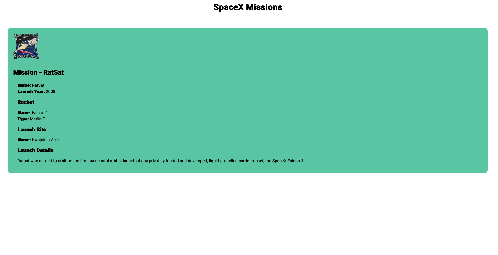
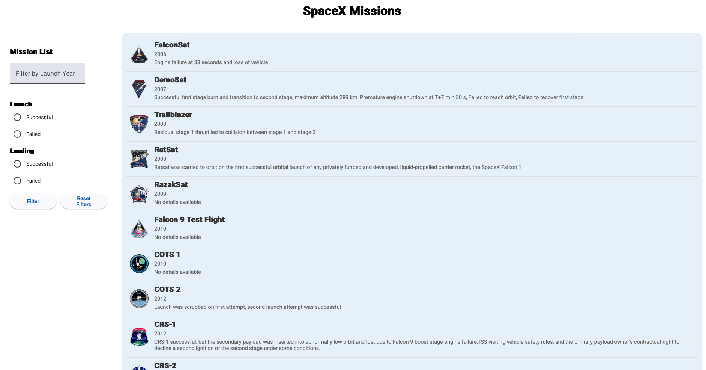

# SpaceX Missions App 

This App contains an Angular project, showcasing SpaceX mission data with filtering and detailed views.

## Live Demo
Check out the live application:  
[https://one01410218-lab-test2-comp3133.onrender.com](https://one01410218-lab-test2-comp3133.onrender.com)

## Project Overview
- **API Used**: SpaceX API (https://api.spacexdata.com/v4/launches) for fetching mission data

## Features
- **Filtering**: Filter SpaceX missions by criteria such as launch year, Success types (Launch and landing).
- **Mission Details**: View detailed information about each mission, including launch Year, rocket name, and mission description, by navigating to specific mission pages.

## API Integration
- **Source**: SpaceX API (https://api.spacexdata.com/v4/launches)

## Here Are some photos Of the App 

